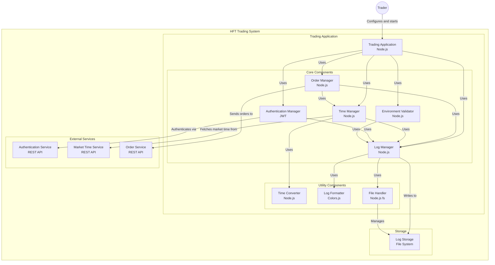

# High-Frequency Trading Bot (TSETMC)

This project is a high-frequency trading bot written in Node.js for TSETMC. The bot logs into a trading platform, retrieves market time, and places orders based on predefined start and stop times. It logs various events and responses from the broker.

## Features

- **Authentication**: Logs into the trading platform using credentials from environment variables.
- **Market Time Check**: Retrieves the current market time and converts it to local time.
- **Order Execution**: Places orders at specified intervals between start and stop times.
- **Logging**: Logs important events and responses, including authentication success, order placement, and broker responses.
- **Environment Validation**: Ensures all required environment variables are set.

